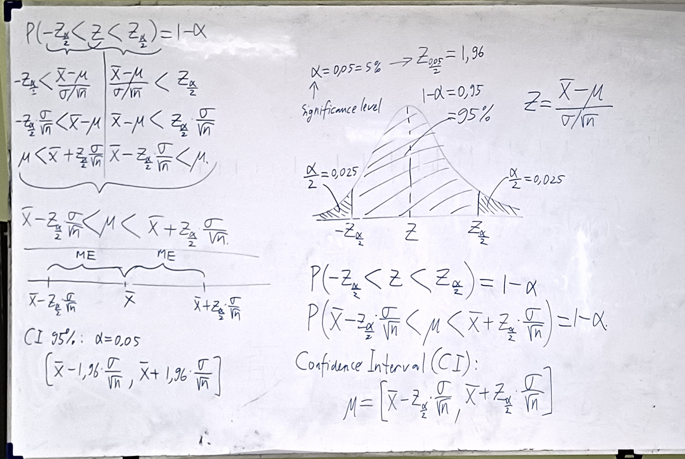

![[Pasted image 20260504124555.png]]
Statistik Inferensi adalah untuk kita mengetahui seberada dekat $\bar x$ dengan $\mu$ 
* Mengetahui margin error dari $\bar x$
* Mencari tingkat confidence

> [!INFO] Analogi
> Jika misal peliharaan kesayangan kita hilang, kita pasti yakin kalau peliharaan kita itu ada di alam semesta ini

dengan Z populasi:
$$
Z = \frac{\bar{x} - \mu}{\sigma / \sqrt n}
$$
## Confidence Interval (CI):
> Merupakan jarak antara 2 margin error

Makna dari Confidence Interval (CI)
![[Pasted image 20260504132344.png]]
Pada 95% CI, maka artinya kita yakin bahwa 95% diantaranya akan memiliki $\mu$
Meski kita tidak tau bahwa ada mana sampling yang mengandung $\mu$, tapi kita bisa berharap bahwa CI kita akan mengandung $\mu$

Jika kita punya 95% CI, lalu kita punya 100 sampel misalnya, maka dengan begitu, kita akan punya 100 buah interval CI juga, nah dari 100 buah sampel itu, kita akan yakin bahwa 95%-nya memiliki $\mu$

## Normal or T distribution?
Kita memanfaatkan *Central Limit Theorem*
![[Pasted image 20260504133659.png]]

dengan
$$
s^2 = \frac{\sum (\bar{x}-x\tiny{i})^2}{n-1}
$$
$$
s = \sqrt{s^2}
$$
$$
\sqrt{n} = 2Z_{\frac{\alpha}{2}} {\times \frac{\sigma}{W}}
$$
Example:
![[Pasted image 20260504134947.png]]
*t* distribution di gunakan dengan *degree of freedom* (df) = n-1
pada kasus, n = 9, maka df = n-1 = 9-1 = 8, sehingga di dapati $t_{0.025,8}$ = 2.306
angka 0.025 didapat dari $\frac{\alpha}{2} = \frac{1-0.95}{2} = \frac{0.05}{2} = 0.025$

Contoh perusahaan dengan ISO 9961 (standar tinggi) 6$\sigma$ yaitu W kecil tetapi CI besar
* Chip/Semikonduktor (Intel, TSMC, dsb)
* Sekrup Pesawat
* NASA

