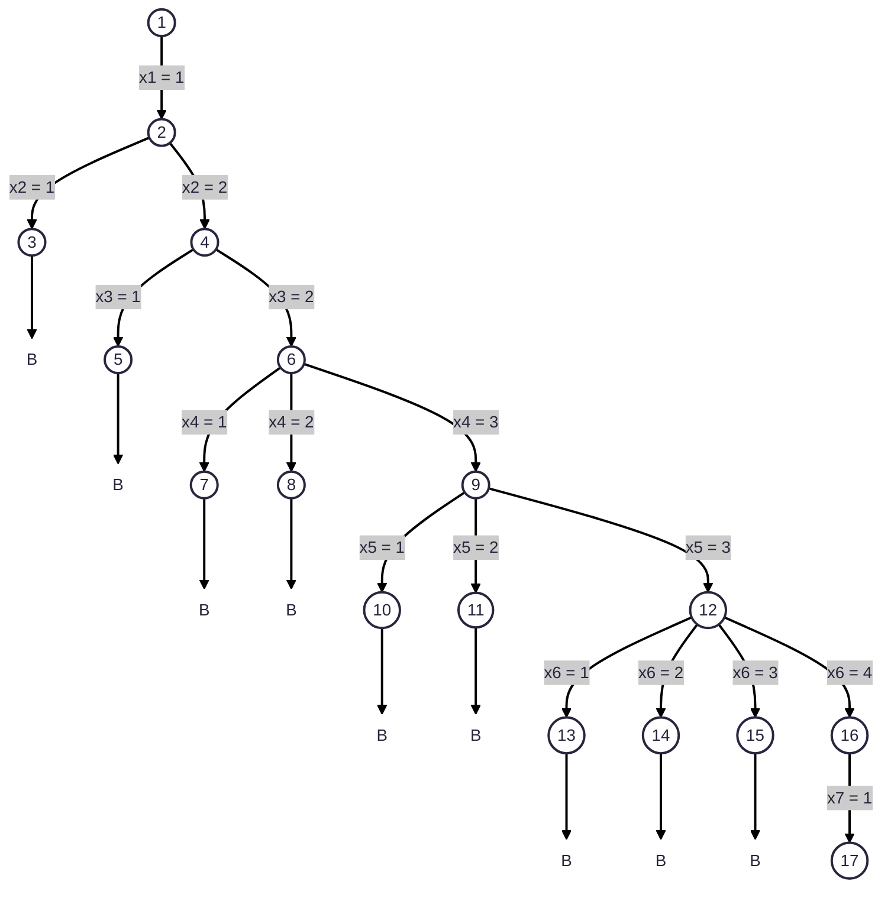

Referensi soal:
![[Kuis2Strategi Algoritmik-C.pdf#height=400]]

# Materi 1: Program Dinamis
![[Pasted image 20260610182614.png|600]]
Daftar Item:

| N   | Weight | Profit |
| :-- | :----: | :----: |
| 1   |   2    |   15   |
| 2   |   3    |   12   |
| 3   |   2    |   8    |
| 4   |   2    |   10   |
Kapasitas Knapsack W = 6

Item 1 - Weight = 2, Profit = 15

| y   | f0(y) | 15 + f0(y-2) | f1(y) | (x1, x2, x3, x4) |
| --- | ----- | ------------ | ----- | ---------------- |
| 0   | 0     | $-\infty$    | 0     | (0,0,0,0)        |
| 1   | 0     | $-\infty$    | 0     | (0,0,0,0)        |
| 2   | 0     | 15           | 15    | (1,0,0,0)        |
| 3   | 0     | 15           | 15    | (1,0,0,0)        |
| 4   | 0     | 15           | 15    | (1,0,0,0)        |
| 5   | 0     | 15           | 15    | (1,0,0,0)        |
| 6   | 0     | 15           | 15    | (1,0,0,0)        |
Item 2 - Weight = 3, Profit = 12

| y   | f1(y) | 15 + f0(y-3) | f2(y) | (x1, x2, x3, x4) |
| --- | ----- | ------------ | ----- | ---------------- |
| 0   | 0     | $-\infty$    | 0     | (0,0,0,0)        |
| 1   | 0     | $-\infty$    | 0     | (0,0,0,0)        |
| 2   | 15    | $-\infty$    | 15    | (1,0,0,0)        |
| 3   | 15    | 12           | 15    | (1,0,0,0)        |
| 4   | 15    | 12           | 15    | (1,0,0,0)        |
| 5   | 15    | 12 + 15      | 27    | (1,1,0,0)        |
| 6   | 15    | 12 + 15      | 27    | (1,1,0,0)        |
dst...
# Materi 2: Algoritma Backtracking
![[Pasted image 20260610182719.png|600]]

a. gambarkan graf dari peta di atas
![[Pasted image 20260610184608.png|240]]
b. Gunakan algoritma backtracking, m=4

# Materi 3: Branch & Bounds
![[Pasted image 20260610190331.png|600]]

| $\infty$ |    9     | $\infty$ |    8     |     | -8  |     | $\infty$ |    1     | $\infty$ |    0     |         |
| :------: | :------: | :------: | :------: | --- | --- | --- | :------: | :------: | :------: | :------: | ------: |
|    10    | $\infty$ |    14    | $\infty$ |     | -10 |     |    0     | $\infty$ |    4     | $\infty$ |         |
|    8     |    15    | $\infty$ |    9     |     | -8  |     |    0     |    7     | $\infty$ |    1     |         |
|    12    |    11    |    10    | $\infty$ |     | -10 |     |    2     |    1     |    0     | $\infty$ |         |
|          |          |          |          |     |     |     |          |          |          |          |         |
|          |          |          |          |     |     |     |    0     |    -1    |    0     |    0     | Total R |
|          |          |          |          |     |     |     |          |          |          |          |      37 |
|          |          |          |          |     |     |     | $\infty$ |    0     | $\infty$ |    0     |         |
|          |          |          |          |     |     |     |    0     | $\infty$ |    4     | $\infty$ |         |
|          |          |          |          |     |     |     |    0     |    6     | $\infty$ |    1     |         |
|          |          |          |          |     |     |     |    2     |    0     |    0     | $\infty$ |         |
Dengan demikian, mulai

|       |    A     |    B     |    C     |    D     |
| ----- | :------: | :------: | :------: | :------: |
| **A** | $\infty$ |    0     | $\infty$ |    0     |
| **B** |    0     | $\infty$ |    4     | $\infty$ |
| **C** |    0     |    6     | $\infty$ |    1     |
| **D** |    2     |    0     |    0     | $\infty$ |
dari A, cari terkecil, ditemukan ke B atau D terkecil, lakukan reduksi sub-matrix A-B

|       |      A       |      B       |      C       |      D       |     |       |     |       |      A       |      B       |      C       |      D       |
| ----- | :----------: | :----------: | :----------: | :----------: | --- | ----- | --- | ----- | :----------: | :----------: | :----------: | :----------: |
| **A** | ==$\infty$== | ==$\infty$== | ==$\infty$== | ==$\infty$== |     |       |     | **A** | ==$\infty$== | ==$\infty$== | ==$\infty$== | ==$\infty$== |
| **B** |      0       | ==$\infty$== |      4       |   $\infty$   |     | -0    |     | **B** |      0       | ==$\infty$== |      4       |   $\infty$   |
| **C** |      0       | ==$\infty$== |   $\infty$   |      1       |     | -0    |     | **C** |      0       | ==$\infty$== |   $\infty$   |      1       |
| **D** |      2       | ==$\infty$== |      0       |   $\infty$   |     | -0    |     | **D** |      2       | ==$\infty$== |      0       |   $\infty$   |
|       |              |              |              |              |     |       |     |       |              |              |              |              |
|       |              |              |              |              |     | Total |     |       |      -0      |      -0      |      -0      |      -1      |
|       |              |              |              |              |     | R =   |     |       |              |              |              |              |
|       |              |              |              |              |     | 38    |     |       |      A       |      B       |      C       |      D       |
|       |              |              |              |              |     |       |     | **A** | ==$\infty$== | ==$\infty$== | ==$\infty$== | ==$\infty$== |
|       |              |              |              |              |     |       |     | **B** |      0       | ==$\infty$== |      4       |   $\infty$   |
|       |              |              |              |              |     |       |     | **C** |      0       | ==$\infty$== |   $\infty$   |      0       |
|       |              |              |              |              |     |       |     | **D** |      2       | ==$\infty$== |      0       |   $\infty$   |
dari A, coba ke D

|       |      A       |      B       |      C       |      D       |
| ----- | :----------: | :----------: | :----------: | :----------: |
| **A** | ==$\infty$== | ==$\infty$== | ==$\infty$== | ==$\infty$== |
| **B** |      0       |   $\infty$   |      4       | ==$\infty$== |
| **C** |      0       |      6       |   $\infty$   | ==$\infty$== |
| **D** |      2       |      0       |      0       | ==$\infty$== |
Tidak ada reduksi baris dan kolom, sehingga R = 37, artinya ke D lebih baik daripada B

dari A-D, cari terkecil, ditemukan B dan C terkecil, langsung aja ke C

|       |      A       |      B       |      C       |      D       |
| ----- | :----------: | :----------: | :----------: | :----------: |
| **A** |   $\infty$   |   $\infty$   | ==$\infty$== |   $\infty$   |
| **B** |      0       |   $\infty$   | ==$\infty$== |   $\infty$   |
| **C** |      0       |      6       | ==$\infty$== |   $\infty$   |
| **D** | ==$\infty$== | ==$\infty$== | ==$\infty$== | ==$\infty$== |
Tidak ada reduksi baris dan kolom, sehingga R = 37, artinya ke C lebih baik daripada ke B

dari A-D-C, cari terkecil, tinggal B doang

|       |    A     |      B       |      C       |      D       |
| ----- | :------: | :----------: | :----------: | :----------: |
| **A** | $\infty$ | ==$\infty$== |   $\infty$   |   $\infty$   |
| **B** |    0     | ==$\infty$== |   $\infty$   |   $\infty$   |
| **C** |  ==0==   | ==$\infty$== | ==$\infty$== | ==$\infty$== |
| **D** | $\infty$ | ==$\infty$== |   $\infty$   |   $\infty$   |
Tidak ada reduksi baris dan kolom, sehingga R = 37
Jalur selesai A-D-C-B, sekarang balik ke A lagi

|       |      A       |      B       |      C       |      D       |
| ----- | :----------: | :----------: | :----------: | :----------: |
| **A** | ==$\infty$== |   $\infty$   |   $\infty$   |   $\infty$   |
| **B** | ==$\infty$== | ==$\infty$== | ==$\infty$== | ==$\infty$== |
| **C** | ==$\infty$== |   $\infty$   |   $\infty$   |   $\infty$   |
| **D** | ==$\infty$== |   $\infty$   |   $\infty$   |   $\infty$   |
ok, pokoknya R = 37, dah gitu aja
# Materi 4: String Matching
![[Pasted image 20260610195214.png|600]]
Fungsi Lo (Last Occurence)???
P = abaca
T = cabadaecdabacadca

Gunakan algoritma Boyer Moore